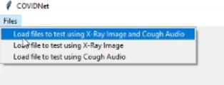
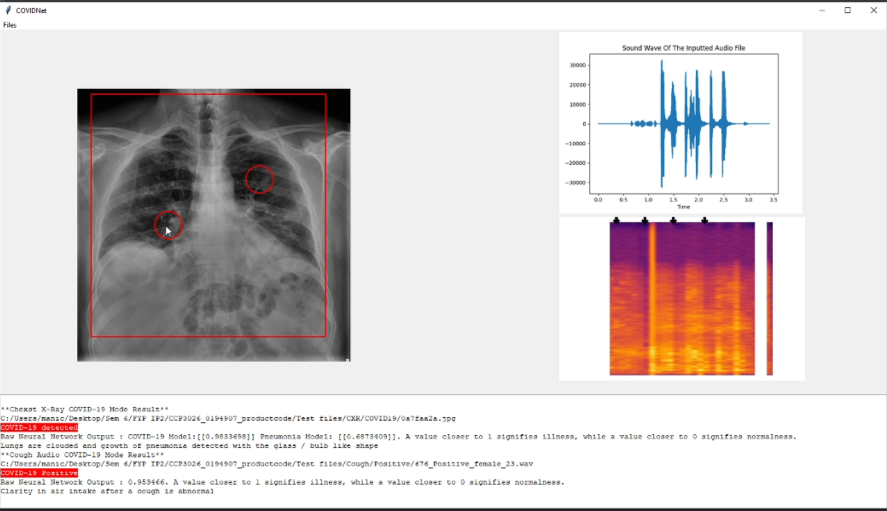
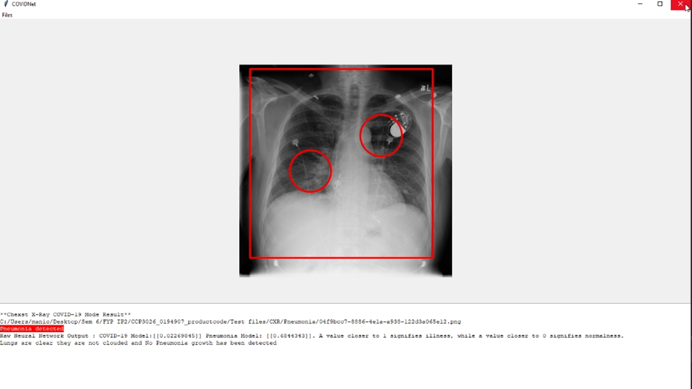

# COVIDNet
Implementing Parallel Architecture on Sound and Image for High Efficacy
---

## Image Snippet 
### UI Options 

The options for COVIDNet are either with both the input Chest X-Ray and Cough Audio file or either one. 
#### COVID-19 Positive

The first options which is both the Chest X-Ray and Cough Audio.

The image snippet above shows both the Chest X-Ray image and Cough Audio file are both positive.

#### non-COVID-19 Pneumonia (Only Chest X-Ray)

The second option which is only with one input Chest X-ray.

The image snippet above shows that the Chest X-Ray image is a non-COVID-19 pneumonia positive

#### Healthy Lungs (Only Cough Audio File)

The third options which is only with the cough audio file.

The image above shows that the audio file which was used in negative and the patients lungs are healthy.

